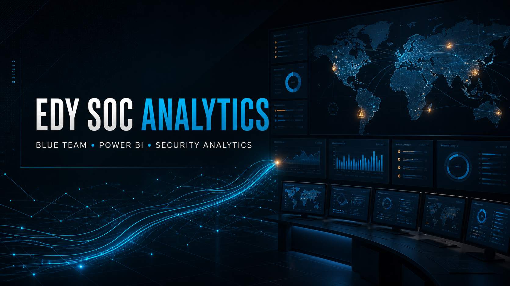
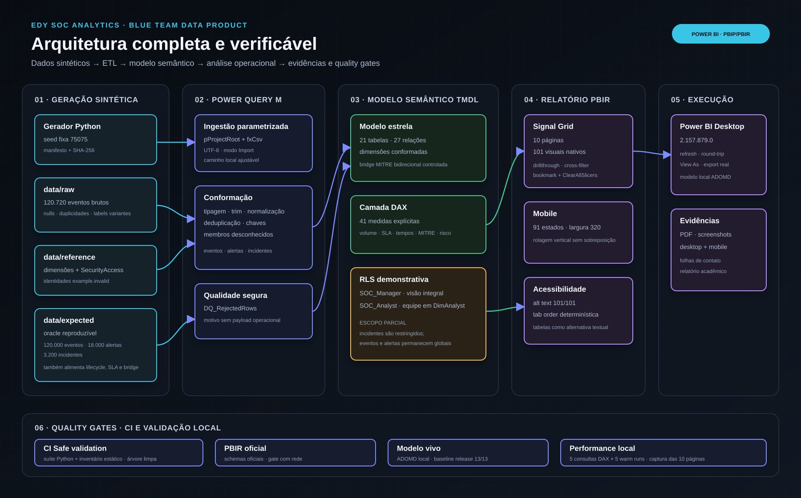
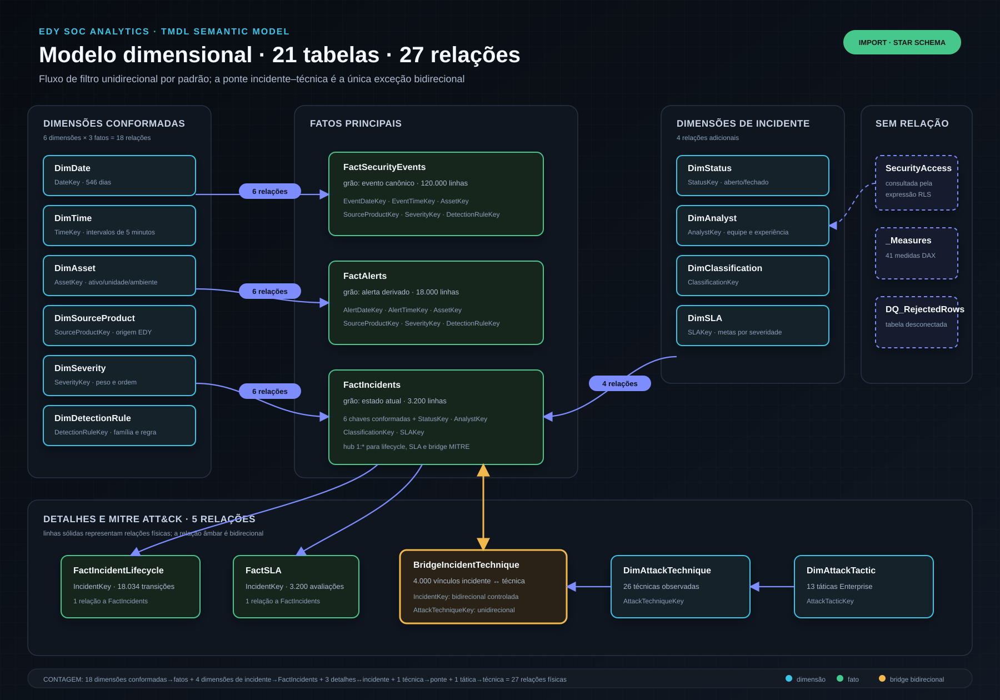
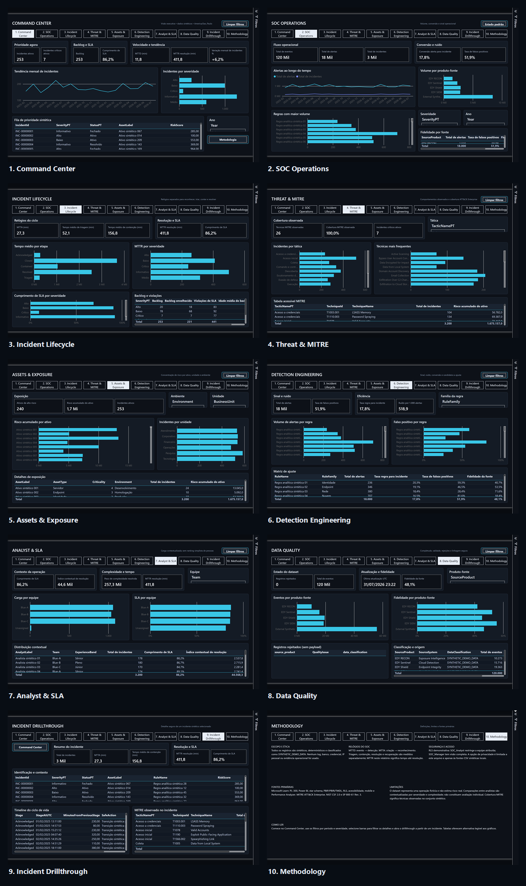
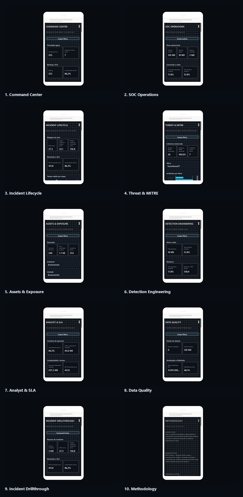

# EDY SOC Analytics

[](https://github.com/EDY075/EDY-SOC-Analytics/actions/workflows/ci.yml)
[](https://github.com/EDY075/EDY-SOC-Analytics/releases)



Camada analítica profissional de SOC construída em Power BI com dados 100% sintéticos, modelo estrela, DAX, MITRE ATT&CK, RLS, experiência mobile e quality gates reproduzíveis.

## Visão em 60 segundos

O EDY SOC Analytics transforma a cadeia **evento → alerta → incidente → resposta** em uma narrativa de dez páginas para Blue Team. Ele mostra prioridade, backlog, SLA, relógios do ciclo de vida, exposição de ativos, comportamento ATT&CK, ruído de detecção e qualidade da fonte. Tudo é auditável em PBIP/PBIR/TMDL e nenhum log, banco, segredo ou credencial operacional foi usado.

| Evidência | Estado atual |
|---|---:|
| Páginas / visuais nativos | 10 / 101 |
| Estados mobile | 91 |
| Tabelas / medidas DAX / relações | 21 / 41 / 27 |
| Papéis RLS | 2 |
| Eventos / alertas / incidentes | 120.000 / 18.000 / 3.200 |
| Lifecycle / vínculos MITRE | 18.034 / 4.000 |
| Testes portáteis desta versão | 28/28 |
| Modelo vivo da release-base | 13/13 asserts |
| Maior p95 DAX aquecido observado | 7,02 ms |

> O RLS de analista restringe incidentes, ciclo de vida, SLA e vínculos MITRE por equipe; eventos e alertas permanecem globais. Os cinco cenários registrados — Blue-A, Blue-B, Blue-C, gerente e identidade sem mapeamento — passaram no modelo vivo. Essa fronteira não representa isolamento integral nem validação no Power BI Service.

## Problema resolvido

Operações de segurança precisam decidir onde agir, não apenas contar alertas. Um painel útil deve responder:

- quais incidentes exigem ação agora;
- onde backlog e SLA se deterioram;
- quais ativos concentram risco;
- quais regras geram ruído;
- em qual etapa a resposta perde tempo;
- quais técnicas MITRE aparecem no conjunto observado;
- se a fonte é atual, rastreável e adequada à interpretação.

O relatório preserva essas perguntas em uma jornada que vai do Command Center ao detalhe do incidente e termina com metodologia e limitações.

## Tecnologias

| Camada | Tecnologias e formatos |
|---|---|
| Dados e testes | Python 3.11+, CSV UTF-8, `unittest`, JSON Schema |
| ETL | Power Query M parametrizado |
| Modelo | Power BI Import, star schema, TMDL, DAX |
| Relatório | PBIP, PBIR, visuais nativos, tema Signal Grid |
| Segurança | RLS dinâmico, UPNs `example.invalid`, scanner de segredos/PII |
| Qualidade | GitHub Actions em Windows/Linux, inventário estático, ADOMD local |
| Referenciais | Microsoft Learn, MITRE ATT&CK Enterprise, NIST CSF 2.0 e SP 800-61r3 |

## Arquitetura



Fontes editáveis e exportações em alta resolução: [docs/architecture](docs/architecture/README.md).

O gerador usa seed fixa e cria camadas `raw`, `reference` e `expected`. Power Query transforma os três fatos principais a partir de `raw`; lifecycle, SLA e bridge MITRE usam atualmente tabelas curadas de `expected`. O modelo TMDL alimenta 41 medidas e o PBIR Signal Grid. Testes cross-platform ficam no CI; modelo vivo, RLS e performance exigem Power BI Desktop aberto.

## Modelo dimensional



Filtros são unidirecionais por padrão. A relação `BridgeIncidentTechnique → FactIncidents` é a única exceção bidirecional, controlada para permitir que tática/técnica filtrem incidentes. A documentação detalhada está em [DIMENSIONAL_MODEL.md](docs/DIMENSIONAL_MODEL.md).

## Funcionalidades

- Command Center executivo e fila de prioridade;
- conversão evento/alerta/incidente e fidelidade da fonte;
- relógios separados para MTTD, MTTA, triagem, contenção, resolução e recuperação;
- backlog, aging, SLA, reabertura e escalonamento;
- táticas e técnicas MITRE observadas;
- concentração de risco por ativo, unidade e ambiente;
- tuning de detecções por volume, falso positivo e conversão;
- carga e SLA contextualizados por equipe, sem ranking simplista de pessoas;
- linhagem, classificação e rejeições sem payload operacional;
- drillthrough por `IncidentId`, timeline e MITRE;
- seleção cruzada, ações de limpeza, navegação e bookmark real;
- 10 layouts mobile e alternativas tabulares aos gráficos.

## Páginas do dashboard

| Página | Pergunta principal |
|---|---|
| 1. Command Center | O que exige atenção agora? |
| 2. SOC Operations | O volume recebido é sinal útil ou ruído? |
| 3. Incident Lifecycle | Em qual etapa a resposta perde tempo? |
| 4. Threat & MITRE | Quais comportamentos aparecem com maior frequência e risco? |
| 5. Assets & Exposure | Onde o risco se concentra? |
| 6. Detection Engineering | Quais regras devem ser ajustadas? |
| 7. Analyst & SLA | Como carga, complexidade e SLA variam por equipe? |
| 8. Data Quality | Os dados são atuais, rastreáveis e adequados? |
| 9. Incident Drillthrough | O que aconteceu em um incidente selecionado? |
| 10. Methodology | Como interpretar os números sem extrapolar o estudo? |

O [guia funcional das páginas](docs/PAGES_GUIDE.md) relaciona objetivo, KPIs, filtros, interações, uso no SOC e exemplo de decisão para cada página.

## Segurança e RLS

Todos os identificadores, nomes, UPNs e endereços de rede são sintéticos. Endereços usam faixas reservadas para documentação; identidades usam `example.invalid`.

| Papel / cenário | Incidentes | Eventos | Alertas | Escopo real |
|---|---:|---:|---:|---|
| `SOC_Manager` | 3.200 | 120.000 | 18.000 | visão integral |
| `SOC_Analyst` Blue-A | 1.060 | 120.000 | 18.000 | incidentes da equipe; telemetria global |
| `SOC_Analyst` Blue-B | 1.037 | 120.000 | 18.000 | incidentes da equipe; telemetria global |
| `SOC_Analyst` Blue-C | 1.087 | 120.000 | 18.000 | incidentes da equipe; telemetria global |
| identidade sem mapeamento | 0 | 120.000 | 18.000 | zero também em lifecycle, SLA e MITRE; telemetria global |

Os cinco cenários estão marcados como `passed` em [live-rls.json](validation/results/live-rls.json). A validação final usou `EphemeralCustomData` porque o engine local rejeitou os UPNs fictícios `example.invalid` via `EffectiveUserName`; a paridade com o filtro da role de produção foi aprovada. Isso não substitui o teste de associação real de usuários ou grupos no Power BI Service. Consulte [RLS_SECURITY.md](docs/RLS_SECURITY.md) antes de interpretar qualquer visual sob RLS.

## Testes e qualidade

Execute a suíte portátil:

```powershell
python -m unittest discover -s tests -v
```

Ela cobre:

- determinismo, schemas, contagens, chaves e integridade referencial;
- lifecycle, SLA, MITRE e KPIs do oracle;
- contrato EDY SIEM e amostras válidas/inválidas;
- segredos, caminhos pessoais, IPs e arquivos proibidos no inventário Git;
- coerência sintética de `SecurityAccess` e roles;
- inventário 10/101/91/21/41/2;
- JSON PBIR, alt text e `tabOrder`;
- links e imagens Markdown locais.

O CI roda em Ubuntu e Windows, regenera o dataset e exige ausência de arquivos modificados ou novos. Gates que dependem do Power BI Desktop não são simulados no runner.

Com o relatório aberto no Desktop:

```powershell
powershell -ExecutionPolicy Bypass -File validation/refresh_live_model.ps1
powershell -ExecutionPolicy Bypass -File validation/validate_live_model.ps1
powershell -ExecutionPolicy Bypass -File validation/validate_live_rls.ps1 -IdentityMode EphemeralCustomData
powershell -ExecutionPolicy Bypass -File validation/measure_performance.ps1
powerbi-report-author validate "powerbi/EDY SOC Analytics.Report" --no-schema --pretty
powerbi-report-author validate "powerbi/EDY SOC Analytics.Report" --pretty
```

O primeiro gate PBIR é estrutural e funciona offline; o segundo consulta os schemas oficiais. Os validadores vivos falham de forma fechada se não conseguirem identificar uma única instância/workspace ou autenticar no engine local. Quando houver mais de uma janela do mesmo relatório, informe explicitamente `-DesktopPid <PID>`; os scripts nunca escolhem uma delas por aproximação.

## Desempenho

A validação isolada de 25/08/2026 executou refresh completo das 20 tabelas em 29,07 s e cinco consultas DAX representativas, cada uma com cinco amostras aquecidas. O maior p95 observado foi 7,02 ms, abaixo do orçamento interno de 2.000 ms. Com apenas cinco amostras, esse valor é descritivo e não um p95 estatisticamente robusto. A evidência anterior de captura/navegação das dez páginas levou 17.400,69 ms, média de 1.740,07 ms por página, incluindo automação e renderização.

Resultados versionados: [refresh.json](validation/results/refresh.json), [live-model.json](validation/results/live-model.json), [live-rls.json](validation/results/live-rls.json), [performance.json](validation/results/performance.json) e [render-performance.json](validation/results/render-performance.json). Metodologia: [PERFORMANCE_BUDGET.md](docs/PERFORMANCE_BUDGET.md).

## Como executar do zero

Pré-requisitos:

- Git;
- Python 3.11+ — o CI usa 3.12;
- Power BI Desktop para Windows com suporte a PBIP/PBIR/TMDL;
- opcional: `powerbi-report-author` 0.1.4 para schemas PBIR;
- opcional: `reportlab` para regenerar o PDF acadêmico.

```powershell
git clone https://github.com/EDY075/EDY-SOC-Analytics.git
cd EDY-SOC-Analytics
python validation/project_inventory.py
python generator/generate_dataset.py
python -m unittest discover -s tests -v
```

Abra [EDY SOC Analytics.pbip](powerbi/EDY%20SOC%20Analytics.pbip) no Power BI Desktop. Ajuste `pProjectRoot` para a raiz atual do clone antes do refresh; esse é o único caminho local materializado no modelo.

O procedimento completo — versões, reconstrução, PBIR, modelo vivo, RLS, desempenho, inspeção visual e exportação oficial — está em [REPRODUCIBILITY.md](docs/REPRODUCIBILITY.md).

## Evidências visuais

Desktop | Mobile
--- | ---
 | 

Capturas individuais reais estão em [screenshots/desktop-final](screenshots/desktop-final), [screenshots/reconcile-live-2026-08-25](screenshots/reconcile-live-2026-08-25) e [screenshots/mobile-final-true](screenshots/mobile-final-true). O PDF exportado pelo Desktop está em [EDY_SOC_ANALYTICS_REPORT.pdf](output/pdf/EDY_SOC_ANALYTICS_REPORT.pdf); o estudo acadêmico está em [RELATORIO_ACADEMICO.pdf](output/pdf/RELATORIO_ACADEMICO.pdf).

Roteiro de apresentação: [DEMO_SCRIPT.md](docs/DEMO_SCRIPT.md).

## Acessibilidade

- 101/101 visuais com texto alternativo;
- ordem de tabulação inteira, não negativa e sem duplicidade por página;
- informação de severidade também em texto;
- tabelas equivalentes para os principais gráficos;
- ações essenciais operáveis por teclado;
- 10 layouts mobile com largura 320 e espaçamento consistente.

Alto contraste do Windows e leitor de tela permanecem validações manuais. O projeto não os declara aprovados sem evidência. Consulte [ACCESSIBILITY_CHECKLIST.md](docs/ACCESSIBILITY_CHECKLIST.md).

## Documentação

- [Relatório acadêmico](docs/RELATORIO_ACADEMICO.md)
- [Guia funcional das páginas](docs/PAGES_GUIDE.md)
- [Reprodução e validação](docs/REPRODUCIBILITY.md)
- [Modelo dimensional](docs/DIMENSIONAL_MODEL.md)
- [Catálogo DAX](docs/DAX_MEASURES.md)
- [Segurança e RLS](docs/RLS_SECURITY.md)
- [Qualidade e linhagem](docs/DATA_QUALITY.md)
- [Acessibilidade](docs/ACCESSIBILITY_CHECKLIST.md)
- [Decisões arquiteturais](DECISIONS.md)

## Limitações conhecidas

- dados sintéticos demonstram comportamento plausível; não estimam risco real;
- RLS não isola eventos e alertas por equipe;
- lifecycle, SLA e bridge MITRE usam a camada curada `data/expected`;
- publicação e role membership no Power BI Service não foram executados;
- `pProjectRoot` precisa ser ajustado após um clone em outro caminho;
- alto contraste e leitor de tela exigem validação manual;
- a captura pública principal da página Drillthrough mostra o estado completo; a validação filtrada de um incidente está registrada em `validation/results/interaction-validation.json`;
- tempos dependem de host, versão e cache;
- PBIX/PBIT só serão apresentados se gerados por fluxo oficial suportado no Desktop.

## Próximas evoluções

1. Projetar isolamento integral de eventos, alertas e incidentes por equipe.
2. Derivar lifecycle, SLA e bridge de fontes brutas independentes.
3. Aumentar a amostra de desempenho e registrar Performance Analyzer por visual.
4. Validar com alto contraste, leitor de tela e usuários finais.
5. Publicar em workspace controlado e atribuir grupos aos papéis.
6. Integrar export real do EDY SIEM somente por contrato e autorização.

## Autor

**Edmilson Gomes** — portfólio em Power BI, Blue Team e Segurança da Informação.
[GitHub EDY075](https://github.com/EDY075) · [Release v1.1.0](https://github.com/EDY075/EDY-SOC-Analytics/releases/tag/v1.1.0)

Este repositório permanece sem arquivo de licença. Os materiais em `linkedin-post/` são recursos de portfólio e não representam publicação automática em redes sociais.
