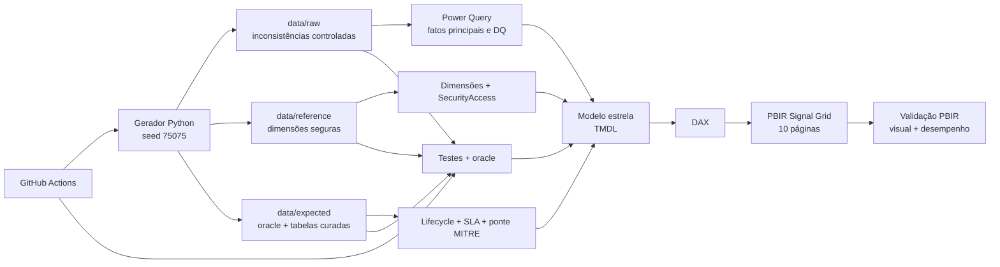

# Linhagem do dataset

## Camadas efetivamente carregadas

| Origem versionada | Tratamento | Destino no modelo |
|---|---|---|
| `data/raw/security_events_raw.csv` | tipagem, normalização, dedupe, chaves e quarentena em M | `FactSecurityEvents`, `DQ_RejectedRows` |
| `data/raw/alerts_raw.csv` | tipagem, dedupe, dimensões conformadas e indicador de conversão em M | `FactAlerts` |
| `data/raw/incidents_raw.csv` | tipagem, dedupe, joins de chaves, relógios e flags em M | `FactIncidents` |
| `data/reference/*.csv` | seleção e tipagem explícita em M | dimensões e `SecurityAccess` |
| `data/expected/FactIncidentLifecycle.csv` | seleção e tipagem explícita | `FactIncidentLifecycle` |
| `data/expected/FactSLA.csv` | seleção e tipagem explícita | `FactSLA` |
| `data/expected/BridgeIncidentTechnique.csv` | seleção e tipagem explícita | `BridgeIncidentTechnique` |

O diretório `data/expected/` não é apenas evidência externa: três tabelas curadas são fontes importadas da versão atual. Os testes continuam tratando todo o diretório como oracle determinístico.

## Rastreabilidade

- Configuração: `generator/config.json`.
- Código: `generator/generate_dataset.py`.
- Manifesto, contagens e SHA-256: `data/dataset_manifest.json`.
- Contrato de exportação: `contracts/edy-siem-export.schema.json`.
- Power Query: `powerbi/power-query/*.m` e expressões no modelo semântico.
- Modelo: `powerbi/EDY SOC Analytics.SemanticModel/definition/`.
- Medidas: catálogo em `docs/DAX_MEASURES.md` e TMDL.
- RLS: `definition/roles/*.tmdl`, `data/reference/SecurityAccess.csv` e `docs/RLS_SECURITY.md`.
- Relatório: `powerbi/EDY SOC Analytics.Report/definition/`.
- Testes: `tests/`, `validation/validate_live_model.ps1` e `validation/measure_performance.ps1`.
- CI: `.github/workflows/ci.yml`.
