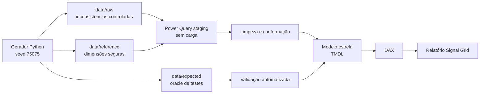

# Linhagem do dataset

## Rastreabilidade

- Configuração: `generator/config.json`.
- Código: `generator/generate_dataset.py`.
- Manifesto, contagens e SHA-256: `data/dataset_manifest.json`.
- Contrato de exportação: `contracts/edy-siem-export.schema.json`.
- Power Query: `powerbi/power-query/*.m` e expressões no modelo semântico.
- Modelo: `powerbi/EDY SOC Analytics.SemanticModel/definition/`.
- Medidas: catálogo em `docs/DAX_MEASURES.md` e TMDL.

