# Modelo dimensional

## Visão lógica

```mermaid
erDiagram
  DimDate ||--o{ FactSecurityEvents : EventDateKey
  DimTime ||--o{ FactSecurityEvents : EventTimeKey
  DimAsset ||--o{ FactSecurityEvents : AssetKey
  DimSourceProduct ||--o{ FactSecurityEvents : SourceProductKey
  DimSeverity ||--o{ FactSecurityEvents : SeverityKey
  DimDetectionRule ||--o{ FactSecurityEvents : DetectionRuleKey

  DimDate ||--o{ FactAlerts : AlertDateKey
  DimTime ||--o{ FactAlerts : AlertTimeKey
  DimAsset ||--o{ FactAlerts : AssetKey
  DimSourceProduct ||--o{ FactAlerts : SourceProductKey
  DimSeverity ||--o{ FactAlerts : SeverityKey
  DimDetectionRule ||--o{ FactAlerts : DetectionRuleKey

  DimDate ||--o{ FactIncidents : CreatedDateKey
  DimTime ||--o{ FactIncidents : CreatedTimeKey
  DimAsset ||--o{ FactIncidents : AssetKey
  DimSourceProduct ||--o{ FactIncidents : SourceProductKey
  DimSeverity ||--o{ FactIncidents : SeverityKey
  DimStatus ||--o{ FactIncidents : StatusKey
  DimDetectionRule ||--o{ FactIncidents : DetectionRuleKey
  DimAnalyst ||--o{ FactIncidents : AnalystKey
  DimClassification ||--o{ FactIncidents : ClassificationKey
  DimSLA ||--o{ FactIncidents : SLAKey

  FactIncidents ||--o{ FactIncidentLifecycle : IncidentKey
  FactIncidents ||--|| FactSLA : IncidentKey
  FactIncidents ||--o{ BridgeIncidentTechnique : IncidentKey
  DimAttackTechnique ||--o{ BridgeIncidentTechnique : AttackTechniqueKey
  DimAttackTactic ||--o{ DimAttackTechnique : AttackTacticKey
```

## Direção de filtro

Todas as relações são 1:* e unidirecionais da dimensão para o fato, exceto as relações de navegação entre incidente e suas tabelas de detalhe. Não há filtro bidirecional. A ponte MITRE evita relacionamento many-to-many direto.

## Dimensões conformadas

Data, hora, ativo, produto-fonte, severidade e regra filtram eventos, alertas e incidentes. Isso permite medir conversão sem misturar granularidades. `DimDate` tem relação ativa com a data principal de cada fato. Datas alternativas do incidente permanecem inativas e são acionadas apenas em medidas explícitas.

## Propriedades de usabilidade

- Colunas técnicas e chaves ficam ocultas no relatório.
- Severidade é classificada por `SeverityOrder`; status por `StatusOrder`; mês por `MonthNumber`/`YearMonth`.
- Hierarquia de data: Ano → Trimestre → Mês → Data.
- Hierarquia MITRE: Tática → Técnica.
- Medidas ficam em tabela exclusiva `_Measures` e pastas `01 Volume`, `02 Operações`, `03 Tempos`, `04 Qualidade`, `05 Tendência`, `06 Contexto`.
- Percentuais têm uma casa decimal; minutos são exibidos como número decimal e não como hora de relógio.

## Role-playing dates

`CreatedDateKey` é a data ativa do incidente. Relações inativas previstas: reconhecimento, triagem, contenção, resolução e fechamento. Medidas que dependem dessas datas usarão `USERELATIONSHIP` somente fora de filtros RLS; análises RLS preferem colunas derivadas/relacionamentos dedicados para evitar comportamento inesperado documentado pela Microsoft.

