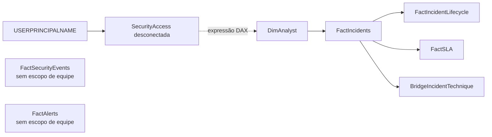

# Modelo dimensional

## Visão lógica

```mermaid
erDiagram
  DimDate ||--o{ FactSecurityEvents : EventDateKey
  DimTime ||--o{ FactSecurityEvents : EventTimeKey
  DimAsset ||--o{ FactSecurityEvents : AssetKey
  DimSourceProduct ||--o{ FactSecurityEvents : SourceProductKey
  DimSeverity ||--o{ FactSecurityEvents : SeverityKey
  DimDetectionRule ||--o{ FactSecurityEvents : DetectionRuleKey

  DimDate ||--o{ FactAlerts : AlertDateKey
  DimTime ||--o{ FactAlerts : AlertTimeKey
  DimAsset ||--o{ FactAlerts : AssetKey
  DimSourceProduct ||--o{ FactAlerts : SourceProductKey
  DimSeverity ||--o{ FactAlerts : SeverityKey
  DimDetectionRule ||--o{ FactAlerts : DetectionRuleKey

  DimDate ||--o{ FactIncidents : CreatedDateKey
  DimTime ||--o{ FactIncidents : CreatedTimeKey
  DimAsset ||--o{ FactIncidents : AssetKey
  DimSourceProduct ||--o{ FactIncidents : SourceProductKey
  DimSeverity ||--o{ FactIncidents : SeverityKey
  DimStatus ||--o{ FactIncidents : StatusKey
  DimDetectionRule ||--o{ FactIncidents : DetectionRuleKey
  DimAnalyst ||--o{ FactIncidents : AnalystKey
  DimClassification ||--o{ FactIncidents : ClassificationKey
  DimSLA ||--o{ FactIncidents : SLAKey

  FactIncidents ||--o{ FactIncidentLifecycle : IncidentKey
  FactIncidents ||--|| FactSLA : IncidentKey
  FactIncidents ||--o{ BridgeIncidentTechnique : IncidentKey
  DimAttackTechnique ||--o{ BridgeIncidentTechnique : AttackTechniqueKey
  DimAttackTactic ||--o{ DimAttackTechnique : AttackTacticKey
```

`SecurityAccess` é uma tabela desconectada. A role `SOC_Analyst` consulta seus valores por DAX para filtrar `DimAnalyst[Team]`; não existe relacionamento físico entre as duas tabelas.

## Direção de filtro

As relações de dimensões conformadas para fatos são 1:* e unidirecionais. A exceção deliberada é `FactIncidents` ↔ `BridgeIncidentTechnique`, configurada com `crossFilteringBehavior: bothDirections`. Ela permite que a seleção de uma técnica atravesse a ponte e filtre medidas de incidente, e que o incidente restrinja suas linhas de técnica.

A relação `BridgeIncidentTechnique` → `DimAttackTechnique` permanece com direção padrão da dimensão para a ponte. Não há segunda rota entre técnica e incidente, o que limita ambiguidade. A exceção bidirecional deve continuar coberta pelo teste `MitreFilter` do modelo vivo e por medição de desempenho.

## Propagação de RLS

O filtro de analista alcança somente o ramo de incidentes. Eventos e alertas compartilham dimensões como data, ativo, severidade e regra, mas essas dimensões não recebem o filtro de equipe; seus totais permanecem globais. Essa fronteira está detalhada em `docs/RLS_SECURITY.md`.

## Dimensões conformadas

Data, hora, ativo, produto-fonte, severidade e regra filtram eventos, alertas e incidentes. Isso permite comparar granularidades sem unir diretamente os fatos. `DimDate` tem relação ativa com a data principal de cada fato.

Dimensões exclusivas de incidentes incluem status, analista, classificação e SLA. A ponte incidente-técnica resolve a relação multivalorada MITRE sem criar many-to-many direto entre fatos e dimensão.

## Tabelas diretamente carregadas e transformadas

- `FactSecurityEvents`, `FactAlerts` e `FactIncidents` são conformadas por Power Query a partir de `data/raw/`;
- `FactIncidentLifecycle`, `FactSLA` e `BridgeIncidentTechnique` importam as tabelas curadas versionadas em `data/expected/`;
- dimensões e `SecurityAccess` importam `data/reference/`;
- `DQ_RejectedRows` deriva da camada raw e conserva apenas razão segura, sem payload.

Assim, `data/expected/` é simultaneamente oracle dos testes e camada curada diretamente carregada para três estruturas auxiliares do modelo atual. Ela não substitui o Power Query das três fatos principais.

## Propriedades de usabilidade

- Chaves técnicas ficam ocultas no relatório.
- Severidade é classificada por `SeverityOrder`; status por `StatusOrder`; mês por `MonthNumber`/`YearMonth`.
- A hierarquia de data é Ano → Trimestre → Mês → Data.
- A hierarquia MITRE é Tática → Técnica.
- As 41 medidas ficam em `_Measures`, organizadas nas pastas `01 Volume`, `02 Operações`, `03 Tempos`, `04 Qualidade`, `05 Tendência` e `06 Contexto`.
- Percentuais têm uma casa decimal; minutos são números decimais, não horas de relógio.

## Datas

`CreatedDateKey` é a data ativa do incidente. Os tempos de reconhecimento, triagem, contenção, resolução, fechamento e recuperação são armazenados em colunas próprias e medidos diretamente. O modelo atual não declara relações alternativas inativas para esses timestamps; portanto a documentação e novas medidas não devem alegar `USERELATIONSHIP` sem que a relação exista no TMDL.
