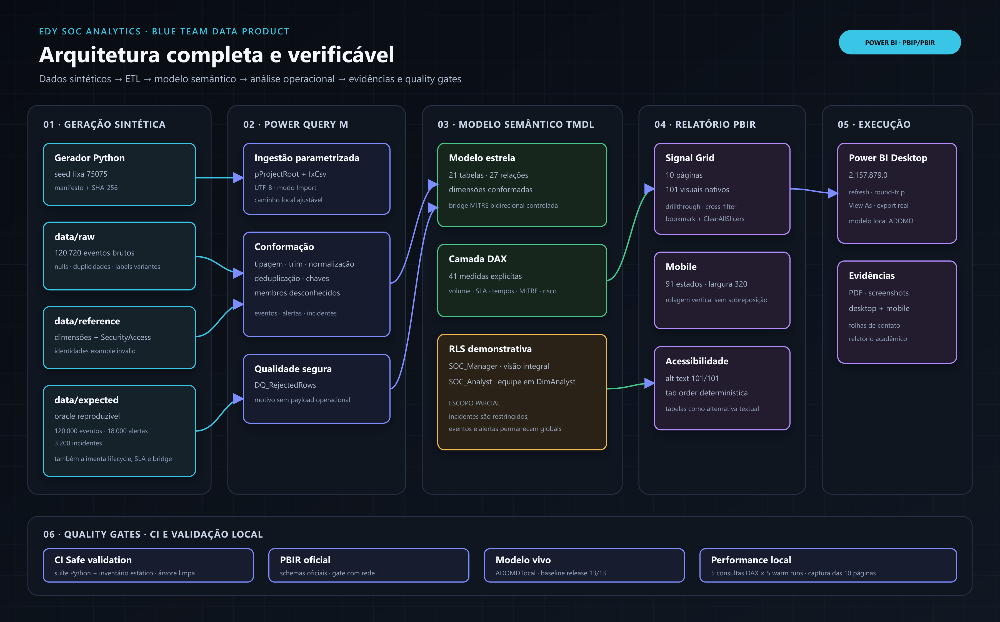
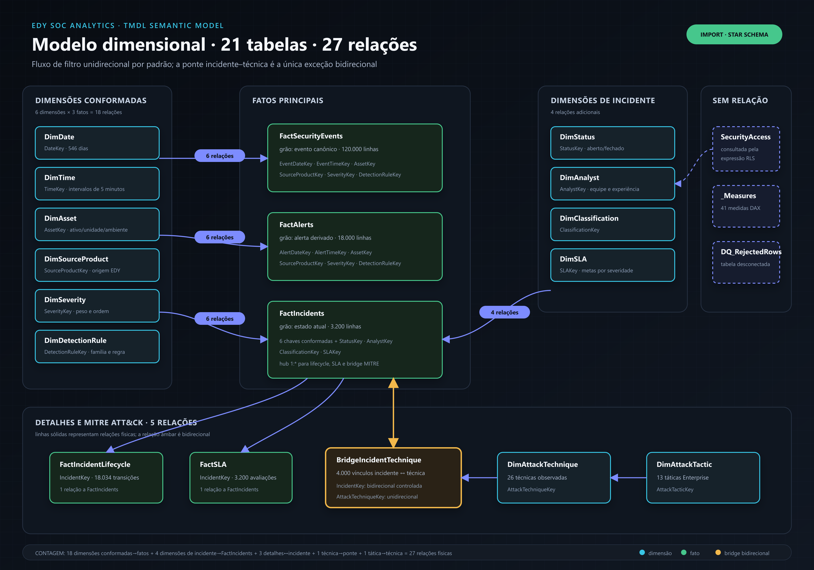

# EDY SOC Analytics — Relatório acadêmico

**Autor:** Edmilson Gomes
**Data:** 25 de agosto de 2026
**Área:** Power BI, Engenharia de Dados e Segurança da Informação

## Resumo

O EDY SOC Analytics é uma solução analítica reprodutível em Power BI para estudar como telemetria de um Centro de Operações de Segurança (SOC) pode ser transformada em informação decisória sem expor dados operacionais. O projeto combina PBIP, PBIR, TMDL, Power Query, modelo dimensional, 41 medidas DAX, segurança em nível de linha, acessibilidade, layouts mobile e validação automatizada. Um gerador determinístico produz 120.000 eventos, 18.000 alertas e 3.200 incidentes sintéticos em 18 meses. O resultado é uma narrativa visual de dez páginas que conecta priorização, ciclo de resposta, MITRE ATT&CK, exposição de ativos, engenharia de detecção, SLA e qualidade de dados. A avaliação também explicita limitações: o RLS de analista restringe o domínio de incidentes, não eventos e alertas globais; o desempenho medido é local; e a publicação no Power BI Service não integra este estudo.

**Palavras-chave:** Power BI; SOC; Blue Team; DAX; Power Query; MITRE ATT&CK; RLS; PL-300.

## 1. Contextualização

Um SOC precisa transformar grande volume de telemetria em decisões verificáveis: o que exige atenção imediata, onde o backlog cresce, quais ativos concentram risco, quais detecções produzem ruído e quanto tempo cada etapa da resposta consome. O desafio não é apenas contar registros, mas preservar a cadeia evento → alerta → incidente → resposta, distinguir relógios operacionais e comunicar incertezas.

O estudo se relaciona às quatro áreas atuais da PL-300 — preparar, modelar, visualizar/analisar e gerenciar/proteger o Power BI [1]. A arquitetura dimensional segue a orientação de esquema estrela da Microsoft [2]. A leitura de táticas e técnicas usa a matriz Enterprise do MITRE ATT&CK [9], enquanto governança e resposta são contextualizadas pelo NIST CSF 2.0 [10] e pela SP 800-61 Rev. 3 [11].

## 2. Problema de pesquisa

**Como projetar e validar, de forma reprodutível e segura, uma solução Power BI capaz de transformar dados sintéticos de operações de segurança em indicadores úteis para priorização e investigação, preservando rastreabilidade, acessibilidade e limites honestos de interpretação?**

Esse problema envolve quatro tensões: realismo sem dados reais; profundidade técnica sem perda de legibilidade; segurança sem alegações superiores ao modelo efetivo; e desempenho medido sem tratar uma estação local como SLA universal.

## 3. Objetivos

### 3.1 Objetivo geral

Construir e avaliar uma solução analítica funcional, reprodutível e segura para representar o estado de um SOC e apoiar decisões executivas e operacionais.

### 3.2 Objetivos específicos

- gerar dados sintéticos coerentes, determinísticos e auditáveis;
- implementar limpeza, tipagem, normalização, deduplicação e quarentena no Power Query;
- modelar fatos, dimensões conformadas e a ponte incidente–técnica;
- definir métricas com relógios operacionais separados;
- entregar dez páginas desktop e dez layouts mobile com narrativa SOC;
- validar filtros, drillthrough, navegação, bookmark, RLS e acessibilidade estrutural;
- automatizar testes de dados, contrato, segurança e estrutura PBIP/PBIR/TMDL;
- medir desempenho local com metodologia e limites explícitos;
- documentar reprodução, decisões e integrações futuras sem credenciais.

## 4. Metodologia

O trabalho adotou uma abordagem de engenharia orientada a evidências em nove etapas: pesquisa primária; definição de contrato; geração do dataset; transformação; modelagem; DAX; composição visual; validação; documentação. Cada afirmação pública foi confrontada com os artefatos executáveis. Resultados manuais só são considerados aprovados quando há registro reproduzível; dependências do Power BI Desktop são separadas dos gates cross-platform.

O gerador Python usa seed fixa. A camada `raw` contém inconsistências controladas; `reference` contém dimensões e autorizações sintéticas; `expected` funciona simultaneamente como camada curada/oracle e, no estado atual, também alimenta diretamente lifecycle, SLA e a ponte MITRE. Esta última escolha é registrada como limitação arquitetural, não como ETL integral a partir de fontes brutas.

## 5. Arquitetura da solução

O fluxo começa em dados sintéticos versionados e no contrato JSON Schema. Power Query aplica transformações e carrega um modelo semântico TMDL. Medidas DAX alimentam o relatório PBIR Signal Grid. Os gates se dividem entre testes Python/CI, validação estática PBIR/TMDL e verificações locais que dependem do Power BI Desktop. O formato PBIP torna relatório e modelo auditáveis em texto e adequados ao controle de versão [3][4].

## 6. Geração, qualidade e linhagem

O dataset cobre 18 meses e contém:

| Conjunto | Registros | Função analítica |
|---|---:|---|
| Eventos de segurança | 120.000 | telemetria, produto-fonte e qualidade |
| Alertas | 18.000 | detecção, ruído e conversão |
| Incidentes | 3.200 | prioridade, backlog, SLA e exposição |
| Transições de lifecycle | 18.034 | relógios por etapa |
| Vínculos MITRE | 4.000 | contexto de tática e técnica |

O manifesto registra seed, período, contagens e hashes. Os testes verificam determinismo, tipos, chaves, integridade referencial, lifecycle, SLA, MITRE e classificação sintética. Eventos sem ativo recuperável usam o membro desconhecido `AssetKey = 0`; incidentes não atribuídos usam `AnalystKey = 0`. O parse de timestamps é tolerante a erro: valores inválidos são convertidos em nulo, classificados e excluídos antes da tipagem final da fato.

## 7. Modelo dimensional

O modelo possui 21 tabelas e 27 relacionamentos. Os fatos representam eventos, alertas, incidentes, lifecycle e SLA. As dimensões conformadas incluem data, hora, ativo, produto-fonte, severidade, status, regra de detecção, tática, técnica, analista, classificação e SLA. A ponte `BridgeIncidentTechnique` resolve a associação many-to-many entre incidentes e técnicas.

Os filtros são unidirecionais por padrão. A relação da ponte para `FactIncidents` usa propagação bidirecional controlada, única exceção, para permitir que técnica/tática filtrem medidas de incidente. Severidade, status, etapa, mês, dia da semana e hora recebem metadados explícitos de ordenação operacional.

## 8. Métricas DAX

As 41 medidas estão organizadas em seis pastas: volume, operações, tempos, qualidade, tendência e contexto. O catálogo executável inclui, entre outras:

- eventos, alertas e incidentes;
- incidentes novos, ativos, fechados e críticos ativos;
- backlog e backlog envelhecido;
- fechamento, escalonamento, reabertura e conversão;
- falsos positivos, ruído e fidelidade da fonte;
- SLA e violações;
- MTTD, MTTA, triagem, contenção, resolução e recuperação;
- comparação mensal;
- cobertura MITRE observada no catálogo sintético;
- risco acumulado e complexidade contextualizada.

Neste relatório, MTTD mede evento até detecção; MTTA mede criação até reconhecimento; MTTR significa tempo até resolução. O termo “cobertura MITRE” não representa a matriz Enterprise inteira: representa as técnicas observadas no catálogo sintético do projeto.

## 9. Segurança e RLS

O modelo possui dois papéis. `SOC_Manager` é irrestrito. `SOC_Analyst` usa `USERPRINCIPALNAME()` e uma tabela de acesso com identidades `example.invalid` para restringir `DimAnalyst` à equipe autorizada. A propagação alcança incidentes, lifecycle, SLA e MITRE.

O escopo efetivo precisa ser interpretado com precisão: eventos e alertas não possuem rota por equipe e permanecem globais. Assim, uma identidade Blue-A espera 1.060 incidentes, mas ainda visualiza 120.000 eventos e 18.000 alertas. Uma identidade sem mapeamento recebe zero incidentes, porém não zero linhas em todo o modelo. A documentação e o validador RLS registram essa fronteira. A orientação oficial também alerta que papéis múltiplos são aditivos; um usuário simultaneamente em analista e gerente recebe a união permissiva [5].

| Cenário | Incidentes | Lifecycle | MITRE | SLA | Eventos | Alertas |
|---|---:|---:|---:|---:|---:|---:|
| Analyst Blue-A | 1.060 | 6.006 | 1.371 | 1.060 | 120.000 | 18.000 |
| Analyst Blue-B | 1.037 | 5.817 | 1.281 | 1.037 | 120.000 | 18.000 |
| Analyst Blue-C | 1.087 | 6.124 | 1.328 | 1.087 | 120.000 | 18.000 |
| Analyst sem mapeamento | 0 | 0 | 0 | 0 | 120.000 | 18.000 |
| Manager | 3.200 | 18.034 | 4.000 | 3.200 | 120.000 | 18.000 |

## 10. Relatório e experiência visual

A identidade Signal Grid usa grafite escuro, superfícies discretas, ciano técnico, âmbar para atenção e vermelho apenas para criticidade. O relatório contém 101 visuais nativos e evita extensões externas. As páginas são: Command Center; SOC Operations; Incident Lifecycle; Threat & MITRE; Assets & Exposure; Detection Engineering; Analyst & SLA; Data Quality; Incident Drillthrough; Methodology.

O relatório oferece navegação por página, slicers, seleção cruzada, drillthrough, ações de limpeza e um bookmark real para restaurar o estado do SOC Operations. A documentação funcional associa cada página a uma pergunta SOC, indicadores, filtros, procedimento e decisão possível.

## 11. Acessibilidade e mobile

Os 101 visuais possuem texto alternativo e ordem de tabulação. Títulos comunicam a pergunta respondida; severidade não depende apenas de cor; tabelas fornecem alternativa textual aos gráficos principais. As recomendações da Microsoft exigem contraste mínimo de 4,5:1, alt text, ordem de tabulação e conteúdo essencial fora de tooltips [6].

As dez páginas possuem 91 estados mobile com 320 pontos de largura e espaçamento vertical de oito pontos, alinhado às recomendações de layout mobile [7]. A validação estrutural não substitui leitor de tela nem o modo de alto contraste do Windows: ambos permanecem em checklist manual e não são declarados aprovados.

## 12. Estratégia de testes

Os gates são separados por responsabilidade:

| Gate | Evidência | Ambiente |
|---|---|---|
| Dataset/contrato/segurança | `unittest` | Windows e CI Linux |
| Inventário PBIR/TMDL | teste estático | Windows e CI Linux |
| Links e imagens locais | teste estático | Windows e CI Linux |
| Schemas PBIR oficiais | `powerbi-report-author validate` | ambiente com acesso aos schemas |
| Modelo vivo | ADOMD e 13 asserts | Power BI Desktop aberto |
| RLS por identidade | ADOMD, `Roles` e `EffectiveUserName` | Power BI Desktop aberto |
| Desempenho DAX | consultas aquecidas e JSON | Power BI Desktop aberto |
| Visual desktop/mobile | inspeção de todas as páginas | Power BI Desktop/capturas reais |

O CI regenera o dataset, executa a suíte, verifica o inventário e falha se houver arquivos modificados ou novos não rastreados. Gated tests que exigem Desktop não são simulados no Linux.

## 13. Resultados

A linha de base pública aprovou 18 testes Python, 13 asserts do modelo vivo, validação PBIR sem erro estrutural e medição local máxima de 8,16 ms entre cinco execuções aquecidas das consultas escolhidas. A suíte ampliada desta revisão aprovou 23 testes portáteis e inventário exato. As vinte capturas da release-base — dez desktop e dez mobile — foram reinspecionadas; a recaptura pós-hardening permanece um gate separado. Foram identificados e tratados no PBIR rótulos técnicos, ordenação operacional, legibilidade da Methodology mobile e espaço do timestamp em Data Quality mobile.

A seleção cruzada já documentada alterou incidentes ativos de 253 para 7 e a limpeza restaurou 253. O bookmark restaurou alertas de 2 mil para 18 mil. O drillthrough foi validado anteriormente no Desktop, porém a captura pública existente mostra a página sem filtro; por isso ela não é usada como evidência de um único incidente e uma recaptura filtrada permanece necessária.

## 14. Desempenho

Cinco consultas representativas foram executadas com cinco amostras aquecidas. O maior valor observado foi 8,16 ms, abaixo do orçamento interno de 2.000 ms. Com apenas cinco amostras, o número antes chamado de p95 coincide praticamente com o máximo e deve ser tratado como evidência descritiva, não estimativa estatística robusta. A captura/navegação das dez páginas levou 17.400,69 ms, média de 1.740,07 ms por página; esse tempo inclui automação e renderização, não apenas DAX. O Performance Analyzer é o mecanismo oficial para decompor o tempo por visual [8].

## 15. Limitações

- os dados são sintéticos e não estimam risco real;
- o RLS atual isola incidentes por equipe, não todos os fatos operacionais;
- `data/expected` também funciona como camada curada de três fatos;
- a publicação e associação de papéis no Power BI Service não foram executadas;
- alto contraste e leitor de tela exigem validação manual no ambiente final;
- o parâmetro local `pProjectRoot` deve ser ajustado após o clone;
- medições variam por host, versão, cache e estado do Desktop;
- a evidência pública de drillthrough deve ser recapturada com um incidente filtrado.

## 16. Trabalhos futuros

As evoluções prioritárias são projetar isolamento integral por equipe para eventos, alertas e incidentes; substituir a dependência de `data/expected` por fontes brutas independentes; aumentar a amostragem de desempenho e complementar com Performance Analyzer; validar com tecnologia assistiva; publicar em workspace controlado; e integrar exportações reais apenas mediante contrato e autorização.

## 17. Conclusão

O EDY SOC Analytics demonstra que um portfólio Power BI pode ser tecnicamente profundo e auditável sem depender de dados sensíveis. O principal resultado não é apenas o dashboard, mas a cadeia verificável entre dados, transformações, modelo, medidas, interface, segurança, testes e documentação. A revisão elevou a precisão das alegações: funcionalidades existentes foram preservadas, divergências foram corrigidas e limites importantes — sobretudo do RLS — passaram a ser parte explícita da qualidade do produto. A solução oferece evidência consistente de competências em Power BI, engenharia analítica e Blue Team, mantendo uma agenda técnica clara para isolamento integral e validações assistivas.

## Referências

[1] MICROSOFT. *Study guide for Exam PL-300: Microsoft Power BI Data Analyst*. Microsoft Learn, atualização de 20 abr. 2026. Disponível em: https://learn.microsoft.com/en-us/credentials/certifications/resources/study-guides/pl-300. Acesso em: 25 ago. 2026.

[2] MICROSOFT. *Understand star schema and the importance for Power BI*. Microsoft Learn. Disponível em: https://learn.microsoft.com/en-us/power-bi/guidance/star-schema. Acesso em: 25 ago. 2026.

[3] MICROSOFT. *Power BI Desktop projects (PBIP)*. Microsoft Learn. Disponível em: https://learn.microsoft.com/en-us/power-bi/developer/projects/projects-overview. Acesso em: 25 ago. 2026.

[4] MICROSOFT. *Power BI Desktop project report folder (PBIR)*. Microsoft Learn. Disponível em: https://learn.microsoft.com/en-us/power-bi/developer/projects/projects-report. Acesso em: 25 ago. 2026.

[5] MICROSOFT. *Row-level security (RLS) guidance in Power BI Desktop*. Microsoft Learn. Disponível em: https://learn.microsoft.com/en-us/power-bi/guidance/rls-guidance. Acesso em: 25 ago. 2026.

[6] MICROSOFT. *Design Power BI reports for accessibility*. Microsoft Learn. Disponível em: https://learn.microsoft.com/en-us/power-bi/create-reports/desktop-accessibility-creating-reports. Acesso em: 25 ago. 2026.

[7] MICROSOFT. *Best practices for creating mobile-optimized Power BI reports*. Microsoft Learn. Disponível em: https://learn.microsoft.com/en-us/power-bi/create-reports/power-bi-create-mobile-optimized-report-best-practices. Acesso em: 25 ago. 2026.

[8] MICROSOFT. *Use Performance Analyzer to examine report performance*. Microsoft Learn. Disponível em: https://learn.microsoft.com/en-us/power-bi/create-reports/desktop-performance-analyzer. Acesso em: 25 ago. 2026.

[9] MITRE. *Enterprise Matrix — MITRE ATT&CK*. Disponível em: https://attack.mitre.org/matrices/enterprise/. Acesso em: 25 ago. 2026.

[10] PASCOE, C.; QUINN, S.; SCARFONE, K. *The NIST Cybersecurity Framework (CSF) 2.0*. NIST CSWP 29, 2024. DOI: https://doi.org/10.6028/NIST.CSWP.29. Acesso em: 25 ago. 2026.

[11] NELSON, A.; REKHI, S.; SOUPPAYA, M.; SCARFONE, K. *Incident Response Recommendations and Considerations for Cybersecurity Risk Management: A CSF 2.0 Community Profile*. NIST SP 800-61 Rev. 3, 2025. DOI: https://doi.org/10.6028/NIST.SP.800-61r3. Acesso em: 25 ago. 2026.
